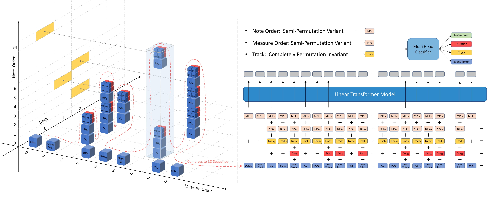

# SymphonyNet

## Introduction
SymponyNet is an open-source project aiming to generate complex multi-track and multi-instrument music like symphony. 

Our method is fully compatible with other types of music like pop, piano, solo music, etc. 

<p>

</p>

Have fun with SymphonyNet!
    
## Installation Guide

We highly recommend users to run this project under [`conda`](https://docs.conda.io/en/latest/miniconda.html) environment. Conda will setup an isolated enviroment where you can install libraries that will not effect the overall system.

### Prepare the Environment

After you install `miniconda` (or the larger `anaconda`), create an environment:

```
conda create -n sym_net python=3.8
```

```
conda activate sym_net
```

### Checkout the Code

```
git clone ...SymphonyNet.git
cd SymphonyNet
```

### Install Dependencies

When you install the python libraries, there are a number of C++ libraries and build dependencies your system will need installed. You can run the following to try to get all the needed bits installed (these commands require things like [`homebrew`](https://brew.sh/) which you should hopefully already have installed):

```
make setup_osx
```

or

```
make setup_linux
```

If you want to try to install the dependencies yourself, or you likely already have them, you can try to just install the python libraries:

```
pip install -r requirements.txt
```

---

**Note**: The reason for using this convoluted process is we find out the `pytorch-fast-transformers` package needs to be built using torch, but directly install with pip requirements may cause `pytorch-fast-transformers` to fail because torch is installed by pip - round and round.

Building `pytorch-fast-transformers` takes a while, please wait patiently.

---

Once everything installes correctly, you can run `make test_run`, and you should get an output file of `output.mid` in the project root directory.

## Training pipeline

### Step 1

Put your midi files into `data/midis/`

### Step 2

Run `python3 src/preprocess/preprocess_midi.py` under project root path.

---

**Note**: The `preprocess_midi.py` multi-process all the Midis and convert them into a `raw_corpus.txt` file. In this file, each line of encoded text represents a full song.

---

### Step 3 (Optional)

- Run `python3 src/preprocess/get_bpe_data.py` if you want to train the model with Music BPE. More details about fast BPE implementation could be found here [`Music BPE`](src/musicBPE/README.md).
- Set `BPE=1` in `config.sh` file

--- 

**Note**: We only provide `music_bpe_exec` file for linux system usage, if you are using MacOS or Windows, please re-compile the `music_bpe_exec` file [`here`](src/musicBPE/README.md) by following the instruction.

---

### Step 4

Run `python3 src/fairseq/make_data.py` to convert the `raw_corpus.txt` into binary file for fairseq and create `four vocabularies` mentioned in the paper. 

### Step 5

Run `sh train_linear_chord.sh` to train your own model.

## Generation pipeline

- Put your checkpoint file into `ckpt/`. You can [download our pretrained model here](https://drive.google.com/file/d/1xpkj_qN4MdLRkBdCXmfGjuWWjnTN1Og0/view?usp=sharing)
- Run `python3 src/fairseq/gen_batch.py test.mid 5 0 1` to generate one symphony MIDI conditioned on the first 5 measures of `test.mid`, with no constraints of chord progression.
- Or replace `test.mid` with your own prime MIDI and set how many measures of chords from the prime MIDI you may want to keep.
- We provide a [Google Colab file](https://colab.research.google.com/github/symphonynet/SymphonyNet/blob/main/play_symphonynet.ipynb) `play_symphonynet.ipynb`, where you could follow the generation guide.

## License

SymphonyNet is released under the MIT license
